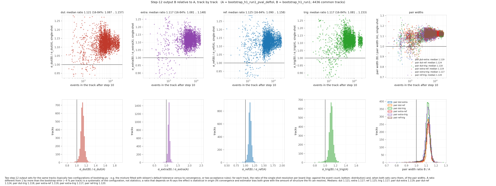
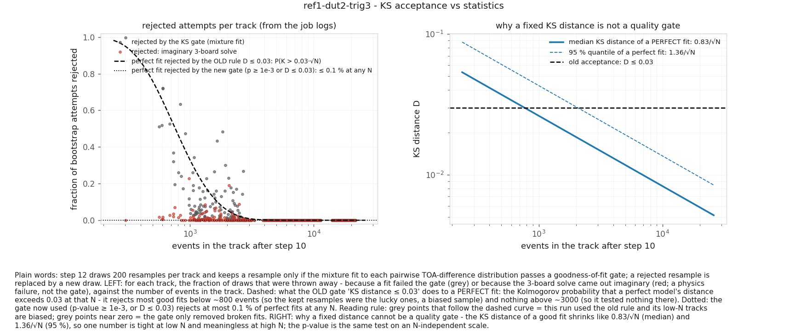
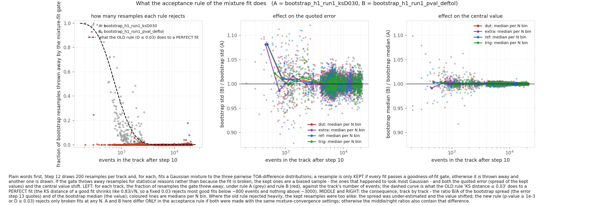
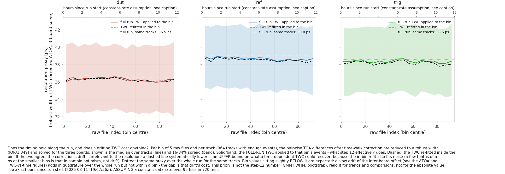
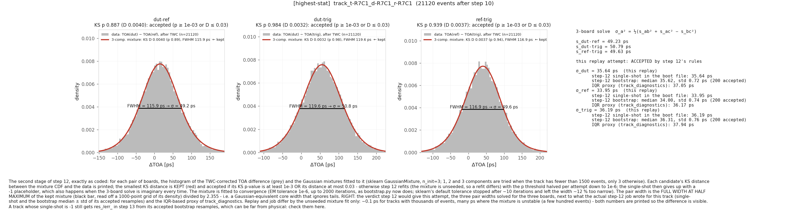

# Pipeline fixes from the first end-to-end pass on H1 run 1 (August 2026)

I ran the full 13-step chain in `TestBeam/condor_at_lxplus/` on `h1_run1` of the CERN irradiation campaign of March 2026 (four boards, all four 3-board combos, 4486 tracks in the final tables), one step at a time, looking at what each step produced before going on. This note lists what turned out to need fixing, in the order it matters for the numbers, with the evidence for each and the commit that carries the change, so each one can be checked on its own. The figures are in `docs/figures/` and every one of them can be regenerated with the commands quoted; all of them come from the diagnostics tools added in the same PR (README sections 7b, 10b, 12b, 13b and the table "Diagnostics at a glance").

The default flow is unchanged in what it does: same steps, same inputs and outputs, same flags. What changes for a user is that step 12 fits the mixture to convergence and gates on the KS p-value (both with new flags, both defaulted), and step 13 flags the tracks whose single-shot failed. Everything else is additive (columns passed through, log lines, optional tools).

## 1. The mixture fit was not converged: every width was about 12 % low

Commit a7834a5, `bootstrap: fit the mixture to convergence (widths were ~12 % low); hybrid KS gate; acceptance bookkeeping`.

Step 12 fits a Gaussian mixture to each pairwise TOA-difference distribution and takes FWHM/2.355 as the pair width. `sklearn.mixture.GaussianMixture` was called with its defaults, `tol=1e-3` and `max_iter=100`. On these distributions EM stops after some ten iterations with `converged_ = True`, but the mixture it stops at is not the converged one: its peak is too high and too narrow. Fitting to convergence (`tol=1e-6`, `max_iter=2000`; the cap is a ceiling, converged fits take 130-200 iterations at 20k events and about 40 at 300) moves the width up by 12 % on the same data, and the KS p-value of the same fit goes from 0.05-0.1 to 0.9-0.99, i.e. the converged mixture also describes the data, the default one did not.

Evidence, track by track over the 4436 tracks both configurations solved (`docs/figures/mixture_convergence_before_after.png`): the ratio converged/default of the single-shot resolution is 1.121 for dut (16-84 %: 1.087-1.157), 1.125 ref, 1.117 trig, 1.117 extra, and 1.117-1.124 for the six pair widths; the ratio is flat in N above about 2000 events (below that the default fit is closer to converged, since there is less structure to resolve, and the spread grows). One 21k-event pair goes from 43.4 to 49.2 ps, its `sigma_dut` from 31.6 to 35.6 ps. The remaining creep between `tol` 1e-6 and 1e-7 is about 0.7 % and is the intrinsic softness of an FWHM-of-a-mixture width; `quote_resolution.py` carries it as the "definition" systematic (`--def-syst`, default 1 %).

Consequence: every resolution produced with the previous defaults is about 12 % low. Step 12 needs to be rerun; a job costs 2-3x what it did.

Reproduce: run step 12 twice on the same tracks (once with `--gmm_tol 1e-3 --gmm_max_iter 100`, once with the defaults) and

    python utils/bootstrap_diagnostics.py compare -a <step-12 dir, default tol> -b <step-12 dir, converged> --time-base <EOS .../tracks_<run>> -o <OUTDIR>

## 2. The acceptance rule of the mixture fit was statistical, not a quality gate

Commits 835aa05, `bootstrap: accept mixture fits on the KS p-value, keep pair widths` (the p-value gate), and a7834a5 of item 1 (the hybrid form, and the bookkeeping).

A pair fit was accepted if its KS distance to the data was at most 0.03. The KS distance of a perfectly good fit shrinks like about 0.83/sqrt(N), so a fixed 0.03 rejects most good fits below about 800 events and none above about 3000: it was a cut on statistics. In the bootstrap phase this matters because rejected resamples are redrawn until 200 are accepted, so at low N the accepted set is the subset of resamples that happened to look most Gaussian, a biased selection whose spread (the quoted error) is too small.

Evidence:

- `docs/figures/ks_gate_fixed_distance_ref1-dut2-trig3.png` (`stats` on the output made with the old rule): the fraction of resamples the gate rejected per track, against the track's N, follows the Kolmogorov expectation for a fixed-distance gate (dashed line) instead of being flat. The same figure for the current output set is `ks_gate_pvalue_ref1-dut2-trig3.png`: nothing rejected at any N except the tracks whose 3-board solve came out imaginary, which is a physics failure, not the gate.
- `docs/figures/ks_gate_before_after.png` (`compare` of the old rule against the p-value rule, same mixture settings): over 2161 common tracks the old rule threw away 32403 resamples, the new one 277. In 300-600 events the old rule rejected 94 % of the resamples and the new one 5 %; in 600-1500 events 23 % against 0 %; above 5000 events neither rejects anything. Where the old rule rejected, the quoted bootstrap error was up to 8 % too small (middle panel, median per N bin) and the central value moved by up to about a per cent (right panel); above about 3000 events the two agree to 0.1 %.

The rule now: a pair fit is accepted if its KS p-value is at least `--ks_pmin` (1e-3, N-independent by construction) or its KS distance is at most `--ks_dmax` (0.03, the old rule at its default threshold), so the accepted set is a superset of the old one at every N and low-N fluctuations are no longer selected (the old code relaxed the distance upward in steps of 0.001 to 0.05 when nothing passed; that relaxation is not kept, the p-value threshold relaxes instead); broken fits (spikes, degenerate mixtures, p far below 1e-3 with a distance far above the statistical one) are still thrown out. A fit that fails outright (no FWHM, non-finite p) is counted as a failure, not as a KS rejection. The relaxation keeps its structure: the threshold halves per failed single-shot attempt and per 100 fruitless bootstrap attempts down to `--ks_pmin_floor` (1e-6; the single-shot tries the floor once, the bootstrap phase keeps drawing at the floor until `--iteration_limit`); the bootstrap phase starts at the threshold the single-shot was accepted at. Each job prints one `[Summary]` line per phase (accepted/attempts, final threshold) and warns when the bootstrap acceptance rate is below 0.7, the biased-selection regime. On run 1 with the current defaults: single-shot 4471 of 4486 tracks accepted at the first threshold, bootstrap 897200 accepted out of 914038 attempts (98.2 %).

Reproduce: `python utils/bootstrap_diagnostics.py stats -d <step-12 dir> --time-base <...> --log-dir condor_logs/bootstrap/<tag> -o <OUTDIR>` gives `stats_ks_gate.png` for any output set (the log dir is where the rejection counts come from); `compare` with `--log-dir-a/--log-dir-b` gives the before/after figure.

## 3. Tracks whose single-shot failed were invisible downstream

Commit 3bea100, `fit_bootstrap_results: flag failed single-shots, schema-robust merge, ksp_min carried as plain values`.

When every full-sample attempt of a track fails (by the gate, or because the 3-board solve is imaginary), step 12 writes a -1 placeholder row for the single-shot and goes on with the bootstrap. Step 13 fitted the resamples and quoted a value and an error for such a track like for any other; nothing in the table said the single-shot had failed, and the value can be unphysical (a solve that barely turned real). Now `single_shot_failed_<col> = 1` marks them, `n_boot` gives the number of accepted resamples (0 with `boot_failed = 1` when the bootstrap phase failed), and `quote_resolution.py` drops flagged tracks before averaging. On run 1: 15 of 4486 tracks (8 + 6 + 1 + 0 over the four combos), none with a failed bootstrap. The merge also became schema-robust (boot files with and without the pair columns and `ksp_min` in the same directory), and `ksp_min` (the smallest pair p-value of the sample) is carried as `ksp_min_single_shot` and `ksp_min_boot_median` instead of being Gaussian-fitted like a resolution.

Reproduce: `python utils/bootstrap_diagnostics.py anatomy --tag near-degenerate -f <track parquet> --boot-file <boot parquet> -o <OUTDIR>` on a flagged track shows the three pair fits, the 3-board solve and where the single-shot sits relative to the resamples.

## 4. Step 10 dropped the raw-file index and the CAL codes

Commit 2836db0, `apply_tdc_cuts: pass the file index and raw CAL through to the time-domain output`.

`convert_to_time` rebuilt its output from scratch with only `toa_/tot_` in ps and the neighbour flags, so the `file` index carried from step 8 and the per-event `cal_<role>` were lost at this step. A track file holds events from the whole run, so `file` is its only time-ordering handle, and CAL is the one input to the CAL-to-ps conversion (a per-file mean CAL sets the bin) that cannot be recovered from the ps values. Both are passed through now; the change is additive (steps 11-13 read only `toa_*`, `tot_*`, the neighbour flags and row counts) and was checked on real run-1 track files, both cut paths: every pre-existing column is byte-identical, the new columns match the surviving source rows by index. What it makes possible is everything in `track_diagnostics.py`: events and cut survival per raw file, CAL/TOT/offset drift along the run, the time-walk correction refitted in bins of files, and a resolution proxy along the run (`docs/figures/resolution_proxy_vs_time_ref1-dut2-trig3.png`).

Reproduce: `python utils/track_diagnostics.py summarize ...` then `python utils/track_diagnostics.py plot -i <OUTDIR>/<run>_<combo>_track_diagnostics.parquet -o <OUTDIR> [--t0 <ISO> --duration-min <D>]` (README 10b has the worked commands).

## 5. Step 8 could not be submitted with inputs on EOS

Commit f08de4a, `io_utils: render /eos inputs in transfer_Input_Files as root://eosuser.cern.ch URLs`.

The lxplus schedds reject a submission whose `transfer_Input_Files` lists `/eos/...` paths (the submit host cannot read them for the job); the same files as `root://eosuser.cern.ch//eos/...` are accepted. `build_transfer_files()` now writes EOS inputs that way and leaves AFS/local paths alone, so step 8, whose track and CAL tables usually live on EOS, submits without hand-editing the JDL.

## 6. path_finder read a random, unreported subset of the files

Commit ae1d75c, `path_finder: --seed and --max_files, sorted input files, the file cap reported`.

Runs with more than 100 feather files had a random 100 read, with no log line, and no random draw was seeded, so the CAL table and the candidate lists differed slightly from one invocation to the next. The cap is now `--max_files` (default 100, unchanged; 0 reads all) and is reported, the input list is sorted, and `--seed` fixes every draw. Nothing else in the step changed.

## 7. Diagnostics

Four optional tools were added in `utils/` (commits 2fab670 telescope, 670e892 track, c5bf3e8 bootstrap, 54b8fa7 quote); none is part of the chain and none changes an output of it. Each writes only figures (plus a parquet, CSV or JSON of the numbers) into its output folder, every figure carries its caption, and every `plot` accepts `--format png|pdf` and `--split` (one file per panel next to the compound figure). The dictionary of figures per tool is in the README (7b telescope and beam after step 7, 10b per-track stability and time-walk after step 10, 12b bootstrap anatomy/stats/consistency/compare after step 12, 13b the quoting recipe after step 13). As one example, the anatomy of the highest-statistics track of run 1 (`docs/figures/anatomy_pairs_highest_stat.png`) shows the three pairwise mixtures with the fit drawn on the data and the KS verdicts, which is where the two problems above were first seen.

Reproduce: `python utils/bootstrap_diagnostics.py anatomy --tag highest-stat -f <EOS .../tracks_<run>/<combo>/time/track_X.parquet> --boot-file bootstrap_<run>/<combo>/track_X_boot.parquet [--diag-parquet <track_diagnostics parquet>] -o <OUTDIR>` (the run-1 command is in README 12b).

## What to do with existing results

Anything produced by step 12 before the convergence fix carries the 12 % bias of item 1 and, for low-N tracks, the too-small errors of item 2. Rerunning step 12 (and 13) on the existing step-10 outputs is enough; steps 6-11 are unaffected. `bootstrap_diagnostics.py compare` between the old and the new output set shows exactly what moved, track by track.
